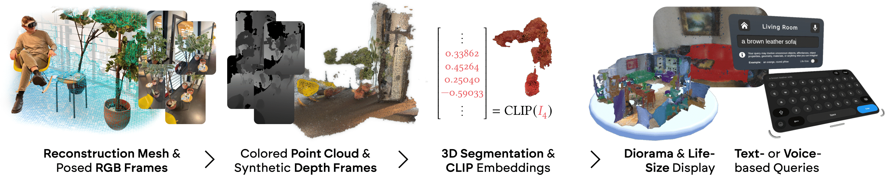
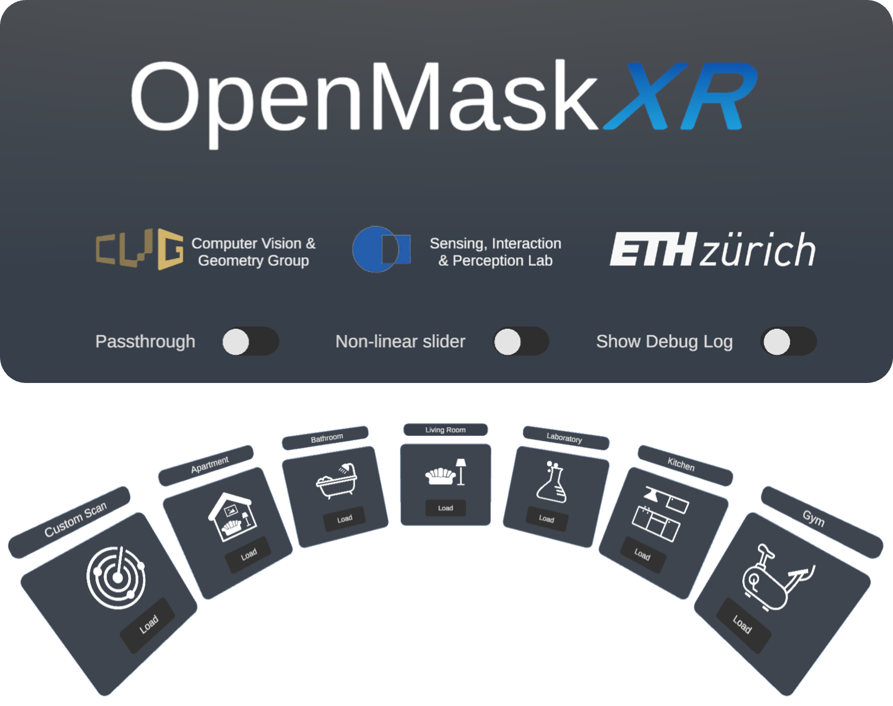

<p align="center">

  <h1 align="center">OpenMaskXR:<br>Open-Vocabulary Scene Understanding in Extended Reality</h1>
  <p align="center">
    <strong>Alexander Zank, 
    Michael Siebenmann
    Hanqiu Li Cai, 
    Omar Majzoub</strong> 
  </p>
</p>

<p align="center">
  <a href="">
    <picture>
    <source media="(prefers-color-scheme: dark)" srcset="./img/cvg-siplab-eth-logos-white.png">
    
    </picture>
  </a>
</p>

<p align="center">
  <a href="">
    
  </a>
</p>

**OpenMaskXR** is our semester project for ETH's Mixed Reality course. We bring [OpenMask3D](https://openmask3d.github.io) to Extended Reality.
With OpenMaskXR, we demonstrate an end-to-end workflow for advanced scene understanding in XR. We implement various
software components whose tasks range from scanning the environment using commodity hardware to processing and displaying it for
open-vocabulary object querying.

## 🛠 Setup

If you want to run OpenMaskXR yourself, you need to run both the XR client and the server at the same time.

### ✨ XR Client

<p align="center">
  <a href="">
    
  </a>
</p>

We include a Meta Quest 3 build under the [Releases](https://github.com/AlexLike/OpenMaskXR/releases/latest) tab of this repository.
Note that our application requires internet access.

OpenMaskXR was designed to target OpenXR-compliant runtimes. That means you may also create a build for other MR headsets, such as the Magic Leap 2, HTC Vive Focus 3 or Pico 4. Additionally, we support Apple Vision Pro in a separate (experimental) build target.
To build the OpenMaskXR client yourself, follow these steps:

1. Install Unity 6000.0.23f1 (higher versions of Unity 6 are untested, but likely to work as well).
2. Clone this repository and open the folder `<Root>/OpenMaskXR` with Unity.
3. Follow the (Unity) guide for setting up your XR headset in an OpenXR project.
4. Adapt line 403 in `ModelManager.cs` to use your API's base URL (see the next section for tips on hosting) with the route `/text-to-CLIP`:
   ```csharp
   StartCoroutine(TextQuery("<your-api-base-url>/text-to-CLIP", $"{{\"text\":\"{query}\"}}"));
   ```
5. Select the build target (Android via OpenXR or visionOS), then create and run a build through `File > Build And Run` or use `Ctrl + B`. (If deploying to visionOS, remember to replace our development team with yours in `project.pbxproj`.)

### 👀 Sensing Emulator

To capture reconstruction meshes, posed RGB-frames, intrinsics, and marker transforms, install our sensing emulator on a modern iOS / iPadOS / visionOS device:

1. Open the project contained in `<Root>/Experimental/OpenMaskXRSensingEmulator` with Xcode.
2. In `project.pbxproj`, replace our development team with yours, keeping automatic signing on. (If deploying on visionOS, obtain the Enterprise Entitlement for Main Camera Access from [Apple's Developer Page](https://developer.apple.com/documentation/visionos/building-spatial-experiences-for-business-apps-with-enterprise-apis) and include it too.)
3. Select your target device and build and run with `⌘R`.

### 🖥️ Server

While you can explore our pre-processed ScanNet200 scenes in XR without having to run the server, it is required for querying.
The server exposes an API that can be used to embed text into CLIP vectors, as CLIP unfortunately cannot run on the headset.
We first describe how to achieve this minimal setup, then discuss how to run our other software components offline.

#### Minimal Setup

Note that the following steps only set up a server for this sole purpose of embedding text into CLIP.
To run the minimal server (and easily expose it to the internet), follow these steps:

1. Install [ngrok](https://ngrok.com/docs/getting-started/) and Python 3.11.
2. Create an ngrok account and connect the agent to your account (see their Quickstart linked in step 1).
3. Create a static domain in your ngrok dashboard.
4. Clone this repository and checkout the `laptop-workaround` branch. (This branch skips imports not required for CLIP-only mode, saving time on low-spec hardware.)
5. Navigate to `<Root>/Server/main`.
6. Create a virtual environment with `python -m venv .venv` and **activate** it.
7. Install necessary packages through `pip install -r requirements.txt`.
8. Run the API script: `python api.py`.
9. In a parallel terminal, run the following: `ngrok http 1234 --url=<your-static-url>`.

#### Running the OpenMask3D Service and other Software Components

If you wish to use our pre- and post-processing scripts working with point cloud and RGB-D data,

1. Checkout the `main` branch of this repository.
2. Inspect the contents of `<Root>/Server/main`. Invoke scripts manually, for instance in a Python REPL session.

If you followed the minimal setup, all dependencies should already be installed.

If you wish to run our dockerized OpenMask3D service,

1. Navigate to `<Root>/Server/openmask3d`.
2. Build the Docker image using `docker build --tag openmask3d`.

To run the image in server mode and start processing the contents of `<your-indir>`,

1. Run `docker run --gpus all -v <your-indir>:/root/input -v <your-outdir>:/root/output -p 2345:80 openmask3d`.

2. Perform an HTTP GET request to `localhost:2345`.
